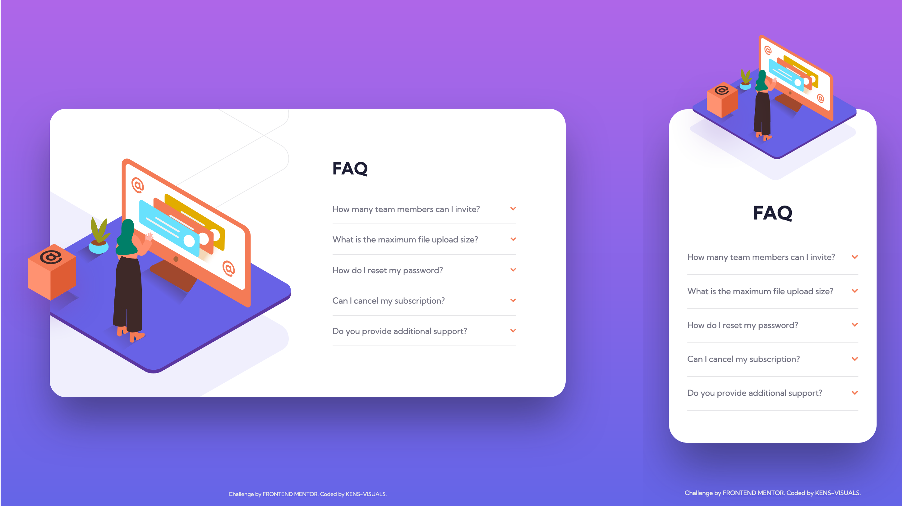

# Frontend Mentor - FAQ Accordion Card Solution

This is a solution to the [FAQ accordion card challenge on Frontend Mentor](https://www.frontendmentor.io/challenges/faq-accordion-card-XlyjD0Oam).

## Table of contents

- [Overview](#overview)
  - [The challenge](#the-challenge)
  - [Screenshot](#screenshot)
  - [Links](#links)
- [My process](#my-process)
  - [Built with](#built-with)
  - [What I learned](#what-i-learned)
  - [Useful resources](#useful-resources)
- [Author](#author)

## Overview

### The challenge

Users should be able to:

- [x] View the optimal layout for the component depending on their device's screen size
- [x] See hover states for all interactive elements on the page
- [x] Hide/Show the answer to a question when the question is clicked
- [x] Bonus: Complete the challenge without using JavaScript

### Screenshot



### Links

- Solution URL: [TBU](https://your-solution-url.com)
- Live Site URL: [TBU](https://your-live-site-url.com)

## My process

### Built with

- Semantic HTML5 markup
- Pure HTML functionality: `<details></details>`
- CSS Flexbox
- Pure CSS animations
- SCSS variables
- Mobile-first workflow

### What I learned

```html
<!-- Adding dropdown functionality in pure HTML -->

<details class="card__detail">
  <summary class="card__detail-summary">
    How many team members can I invite?
    
  </summary>
  <p class="card__detail-text">
    You can invite up to 2 additional users on the Free plan. There is no limit
    on team members for the Premium plan.
  </p>
</details>
```

```css
/* Animationg the same dropdown with some simple transitions */

.card__detail {
  &:not([open]) {
    height: 3.5em;
  }

  &[open] {
    color: $color-primary;
    height: 7em;
    transition: all 0.5s ease-out;

    & .card__detail-summary {
      font-weight: 700;
    }

    & .card__detail-summary--img {
      transform: rotate(180deg);
    }
  }
}
```

### Useful resources

- [MDN: HTML `<details></details>`](https://developer.mozilla.org/en-US/docs/Web/HTML/Element/details) - This helped me to fully understand how HTML details work, also further helped for styling them.
- [CSS-Ticks: `<details></details>` animations](https://css-tricks.com/how-to-animate-the-details-element/) - Some other methods that I found on CSS-ticks on how to animate details.

## Author

- Frontend Mentor - [@kens-visuals](https://www.frontendmentor.io/profile/kens-visuals)
- Codewars - [@kens_visuals](https://www.codewars.com/users/kens_visuals)
- CodePen - [@kens-visuals](https://codepen.io/kens-visuals)
